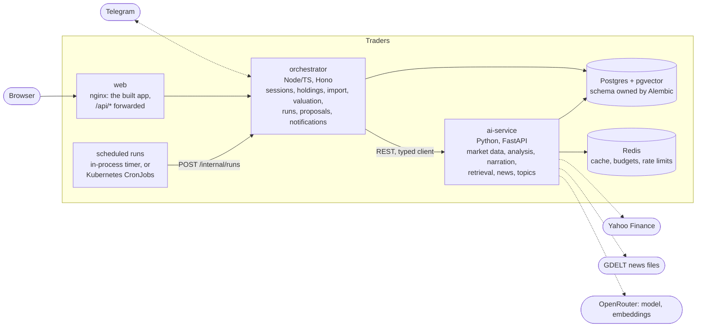

# Traders — AI Financial Advisor & Portfolio Copilot

Portfolio tracking with **explained observations**. The system watches your holdings and the
themes you care about, and tells you what moved and why — with the data and sources behind every
claim. It never places an order.

> **Educational and informational only.** Nothing this system produces is investment advice.
> Approved recommendations are recorded in a virtual ledger so their accuracy can be tracked over
> time; no broker is ever contacted. Prices may be delayed.

| Document | What it covers |
|---|---|
| [docs/PRD.md](docs/PRD.md) | Problem, product stances, functional requirements, success criteria |
| [docs/DESIGN.md](docs/DESIGN.md) | Architecture, decisions and rejected alternatives, data model, security |
| [docs/FLOWS.md](docs/FLOWS.md) | Diagrams for import, scheduled runs, HITL, Telegram, topics, RAG |
| [docs/MILESTONES.md](docs/MILESTONES.md) | Milestone plan with exit criteria |
| [docs/RUNBOOK.md](docs/RUNBOOK.md) | Operating it: rotate keys, replay a run, recover a stuck proposal |
| [docs/DECISIONS.md](docs/DECISIONS.md) | Index of every argued decision, with a pointer to its reasoning |
| [infra/k8s/README.md](infra/k8s/README.md) | The Kubernetes deployment, object by object |

---

## Quick start

```bash
bash scripts/dev-docker.sh
```

That is the whole setup: it creates `.env` with generated secrets on first run, builds the
images, starts everything, waits until the stack is genuinely ready, and prints the dashboard URL
and your sign-in passphrase. Then import `data/fixtures/demo-portfolio.csv`.

### Two ways to run it

| | `scripts/dev-docker.sh` | `scripts/dev-local.sh` |
|---|---|---|
| **Use when** | demoing, infrastructure work, migrations, anything CI must match | writing application code, debugging, fastest iteration |
| Runs in containers | everything | Postgres and Redis only |
| Runs on your Mac | nothing | the three application processes |
| Reload speed | seconds (rebuild) | instant (native watch) |
| Needs installed | Docker | Docker, pnpm, uv |

Both read the same `.env` and share one database, so you can switch between them freely.
`--help` on either explains its options.

No API keys are needed: the default provider chain starts with a fixture provider, so the whole
system runs offline. Set `MARKET_DATA_PROVIDERS=yfinance,fixture` in `.env` to prefer live
(delayed) Yahoo Finance prices.

| Service | Default URL |
|---|---|
| Web dashboard | http://127.0.0.1:5173 |
| Orchestrator API | http://127.0.0.1:8080 (`/healthz`, `/readyz`) |
| AI service | http://127.0.0.1:8000 (`/docs`) |

Every published port is configurable in `.env` (`WEB_HOST_PORT`, `ORCHESTRATOR_HOST_PORT`,
`AI_SERVICE_HOST_PORT`, `POSTGRES_HOST_PORT`, `REDIS_HOST_PORT`) for when another project on your
machine already owns one. Only the host side moves; the ports inside Docker never change. Prefer
`127.0.0.1` over `localhost`: on macOS `localhost` resolves to IPv6 first, which may be a
different process entirely.

## Run it on Kubernetes

The same app on a local [kind](https://kind.sigs.k8s.io) cluster - Kubernetes running inside one
Docker container - next to (and independent of) the compose stack. You need Docker Desktop and:

```bash
brew install kind kubectl
bash scripts/k8s-up.sh
```

One command: it creates the cluster, builds the three production images and loads them into it,
generates the cluster's secrets (git-ignored), migrates the database, loads the concept corpus and
the instrument universe, starts the services, and waits until every one is ready. The first run
spends most of its time building the images - a few minutes (four in CI, from nothing); later
runs reuse Docker's build cache and take about two. Then open **http://traders.localhost**, sign in with the passphrase it
printed (`grep APP_PASSPHRASE infra/k8s/overlays/kind/secrets.env` shows it again), and use
**Import** to load `data/fixtures/demo-portfolio.csv` - the cluster starts with an empty
portfolio of its own.

The cluster needs no API keys and no `.env`: real prices come from Yahoo, which needs none; news,
embeddings and narration use the offline paths; Telegram is off. Scheduled runs are CronJobs, the
AI service scales between one and three copies, and `bash scripts/k8s-down.sh` deletes it all.
CI runs the same one command on every pull request. What each Kubernetes object is and why it
exists: [infra/k8s/README.md](infra/k8s/README.md).

## Architecture



- **The browser talks to one origin.** nginx serves the app and forwards `/api/*` to the
  orchestrator; `/api/internal/*` is not reachable from outside.
- **Every scheduled run enters through `POST /internal/runs`** with a run key, whichever of the
  two schedulers triggered it, so a repeat is answered `skipped` instead of doing the work twice.
- **The AI service keeps no state of its own** (Redis and Postgres hold it), so it can run as
  several copies; the orchestrator holds import previews in memory and runs as one.
- **Nothing is invented.** Every figure in generated text is checked against the evidence it came
  from, and a price nobody can provide is shown as unpriced, never as zero.

[docs/DESIGN.md](docs/DESIGN.md) explains why each piece was chosen and what was rejected;
[docs/FLOWS.md](docs/FLOWS.md) draws the main flows.

## Repository layout

```
apps/web            React + MobX + Tailwind dashboard (Vite)
apps/orchestrator   REST API, valuation, import, runs, proposals, Telegram
packages/shared     Shared types, money helpers, generated AI-service client
services/ai         FastAPI service: market data, analysis, narration, RAG, news, topics;
                    owns the database schema (Alembic)
infra/docker        Dockerfiles and the production nginx config
infra/compose       local docker-compose environment
infra/k8s           Kubernetes: base manifests, the kind overlay, ingress and metrics add-ons
data/corpus         concept explanations, ingested into the database (CC0)
data/universe       the instrument universe for topic resolution
data/fixtures       offline prices, instruments and a demo portfolio
scripts             dev-docker.sh, dev-local.sh, k8s-up.sh, k8s-down.sh, smoke-test.sh
```

## Development

```bash
pnpm install                       # workspace dependencies
pnpm -r typecheck                  # TypeScript across web, orchestrator, shared
pnpm -r test                       # vitest suites
pnpm gen:api                       # regenerate the AI-service client from openapi.json

cd services/ai
uv venv --python 3.12 && uv pip install -e '.[dev]'
.venv/bin/pytest -q                # hermetic: fixture provider, no network
.venv/bin/ruff check . && .venv/bin/ruff format .
python scripts/export_openapi.py   # after changing any pydantic wire model
```

`bash scripts/smoke-test.sh` runs the full vertical slice against a live stack: login, import,
valuation, snapshot run, idempotency and auth checks, questions answered from the corpus, and a
topic resolved. CI runs it against compose on every push, and deploys the kind cluster too.

## Operating it

[docs/RUNBOOK.md](docs/RUNBOOK.md) covers both stacks: rotating each key and secret (and the
database password, which needs care), replaying a scheduled run, recovering a stuck proposal, and
the everyday "is it up, did the runs happen" checks.

## What it costs to run

Nothing, by default: every provider has a keyless path, and CI and a fresh clone use it.

| | Default | What it costs when turned on |
|---|---|---|
| Prices | fixture data (compose), Yahoo Finance (cluster) | Yahoo is free, 15-minute delayed, no key |
| News | fixture | GDELT's raw files are free: about 96 downloads and **~300 MB a day** |
| Explanations | templates - fixed phrasing over checked figures | a model through OpenRouter: about $0.0015 per explanation, **~$0.45 a month** at ~10 findings a day; `LLM_DAILY_BUDGET_USD` caps the day |
| Embeddings | a hashed fixture (keyword search only) | `openai/text-embedding-3-small`: re-embedding the corpus ~$0.0001; the universe's first load (~5,200 descriptions) ~$0.02, then only what changed |
| Instrument descriptions | none (topic resolution answers "unavailable") | free from Yahoo, but about an hour to build the first time |

Machine resources, measured on an Apple M1 with 8 GB given to Docker: the compose stack uses about
1 GB of memory; the kind cluster's node about 1.9 GB, of which the app and its add-ons reserve
~0.5 CPU cores and ~1.1 GiB (the rest is Kubernetes itself). Both fit side by side.

## Conventions

- **Money** is integer minor units plus an explicit currency code, everywhere. Never a float.
  Cost basis is stored **per unit**; totals are computed at read time.
- **Quantities** cross the wire as decimal strings so fractional crypto stays exact.
- **Timestamps** are ISO 8601 UTC; "today" is resolved in the user's timezone (`APP_TIMEZONE`,
  default `Asia/Jerusalem`).
- **Nothing is invented.** A price nobody can provide is `null` and is reported as unpriced — never
  zero, never hidden. Figures in generated text come from structured data, never from a model.
- **Runs are idempotent.** Scheduled work enters through `POST /internal/runs` with a run key, so a
  double trigger is a no-op.
- **English only** in code, comments, commits and documentation.

## Status

Milestones 0 to 6 are complete: the portfolio and its valuation, real price history, four kinds of
finding explained in checked sentences, concepts and a question-answering screen grounded in a
corpus, proposals with deadlines that write to a paper ledger, Telegram, themes discovered in the
news, and the finished web app. Milestone 7 - Kubernetes and this documentation - is the current
one. See [docs/MILESTONES.md](docs/MILESTONES.md).
