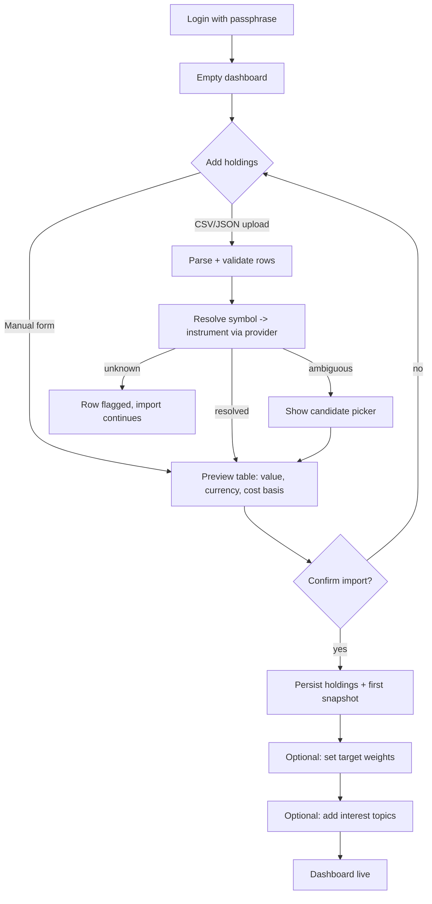
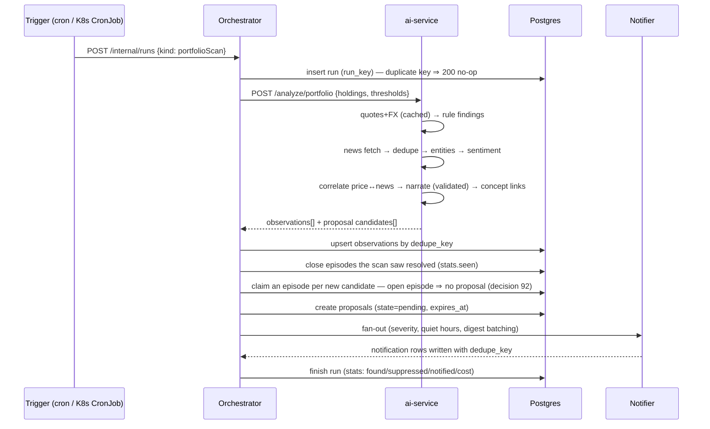
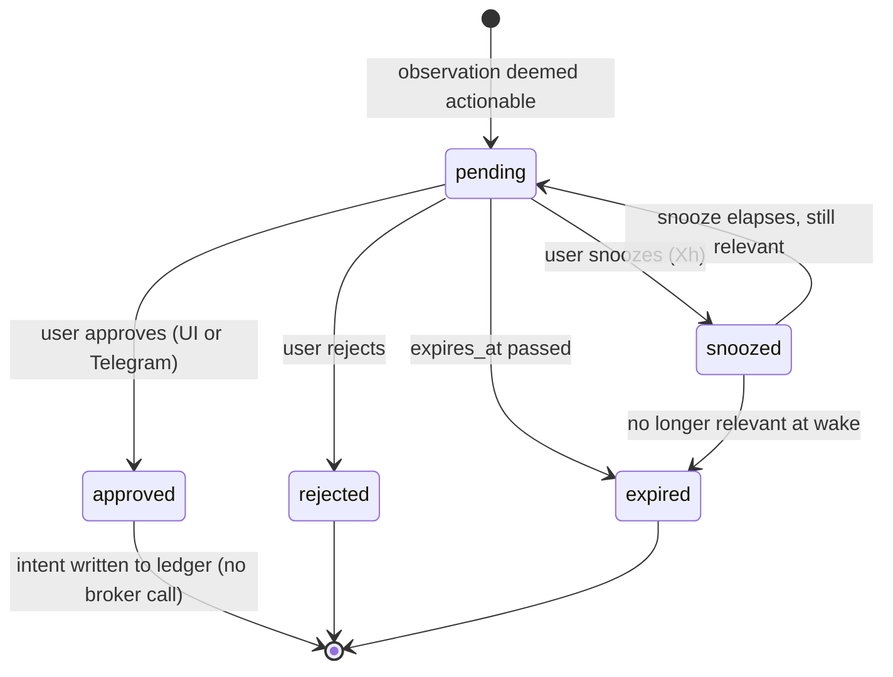
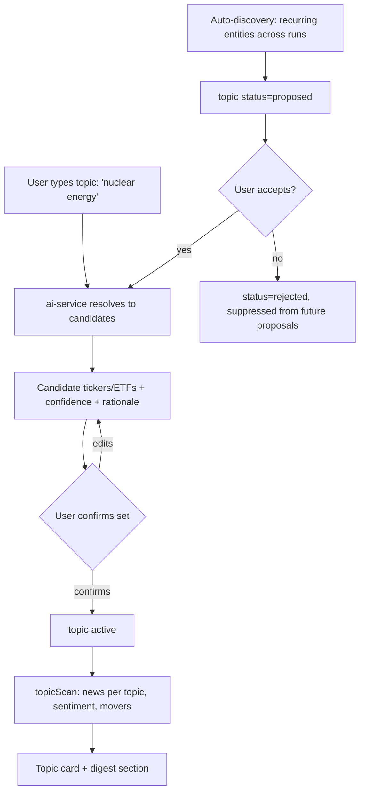
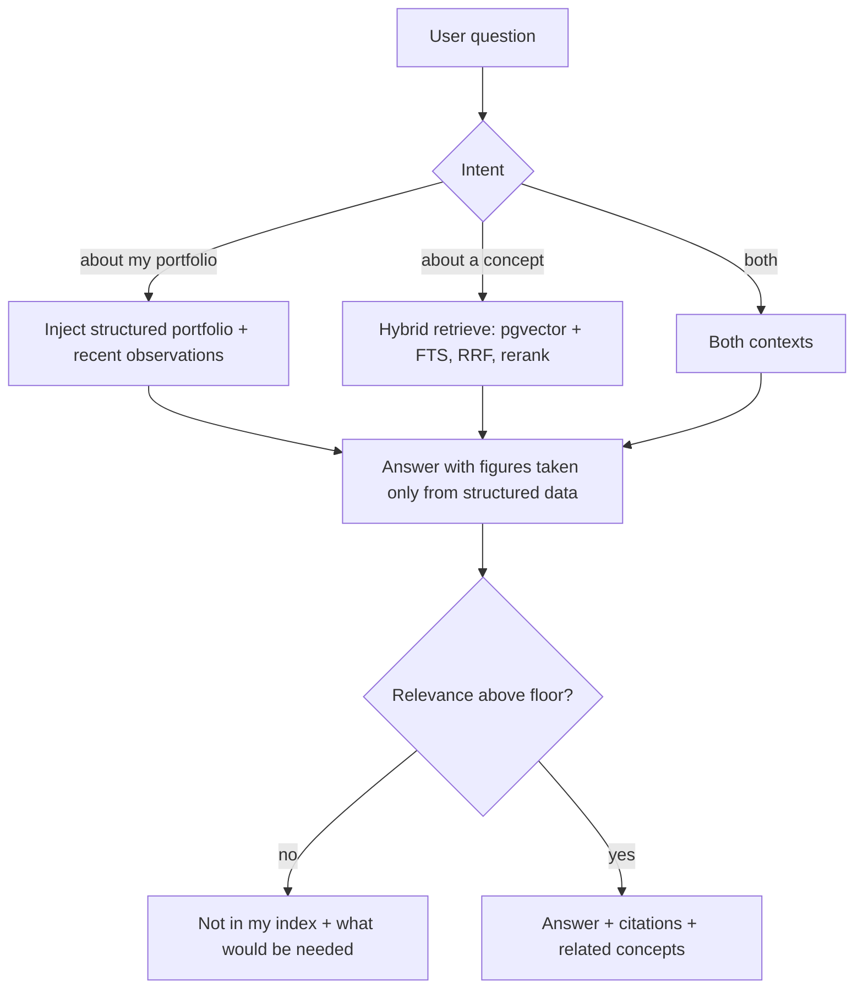

# Flows

Companion to [PRD.md](PRD.md) and [DESIGN.md](DESIGN.md). Each flow lists the happy path,
the failure branches we actually handle, and the state it touches.

---

## F1 — Onboarding & portfolio import


Rules: import is all-or-nothing per *file* only on parse failure; per-row resolution failures
are reported and skipped, never silently dropped. Re-uploading the same file offers
merge-or-replace rather than duplicating holdings.

---

## F2 — Scheduled portfolio scan


Failure branches: provider outage ⇒ run marked `degraded`, rule layer still runs on last-known
quotes with staleness noted; LLM budget exhausted ⇒ observations emitted without narration and
flagged `narration: skipped`; ai-service unreachable ⇒ run marked `failed`, one retry with
backoff, no notification; partial success is persisted (never all-or-nothing).

---

## F3 — Human-in-the-loop proposal


Invariants: transitions are idempotent (second tap on the same button returns the current
state, never re-applies); an expired proposal can never be approved — the UI/bot answers
"this has expired, here is the refreshed view"; every transition writes an immutable audit row
with surface, actor and the evidence snapshot the decision was made on.

---

## F4 — Telegram binding & approval

```mermaid
sequenceDiagram
  participant U as User
  participant W as Web UI
  participant TG as Telegram
  participant O as Orchestrator
  U->>W: "Connect Telegram"
  W->>O: POST /telegram/bind-token
  O-->>W: deep link t.me/<bot>?start=<signed,TTL,single-use>
  U->>TG: taps link
  TG->>O: webhook /start <token> (+ secret-token header)
  O->>O: verify signature, TTL, unused; bind chat_id↔user
  O-->>TG: "Connected."
  Note over O,TG: later — an alert with inline buttons
  O->>TG: message + callback_data {proposal_id, action, nonce} HMAC-signed
  U->>TG: taps Approve
  TG->>O: callback_query
  O->>O: verify HMAC, burn nonce, check chat binding + expires_at
  O->>O: apply transition (same state machine as UI)
  O-->>TG: edit message → "Approved ✓ (by you, 14:32)"
```
Unbound chat ⇒ ignored silently. Replayed callback ⇒ nonce already burned ⇒ answered with the
current state. Bot commands in v1: `/start`, `/portfolio`, `/pending`, `/mute <duration>`, `/stop`.

---

## F5 — Topic tracking & auto-discovery


Auto-discovery never subscribes on its own (PRD FR-11). A rejected theme is remembered so the
same proposal doesn't return within `TOPIC_REJECTION_COOLDOWN_DAYS` (default 90). "The same" means
every word of the rejected label appears in the new one, or at least half of the new proposal's
instruments were offered with the rejected one. Discovery reads recurring phrases in headlines
collected for what the user already follows (`topic_discovery` run, daily).

---

## F6 — Ask a question (RAG)



---

## F7 — Daily digest

Fires once after market close (user timezone): portfolio delta and equity curve, top N
observations by severity, per-topic sentiment shift, pending proposals awaiting the user.
Delivered to UI inbox + Telegram as one message. Suppressed entirely if nothing crossed a
threshold and there are no pending proposals — silence is a valid digest.
